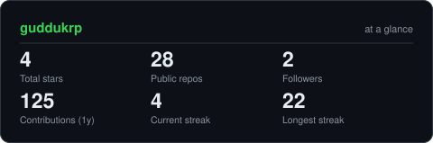
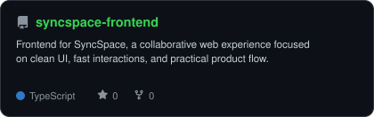
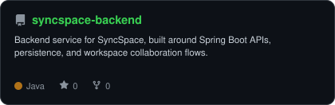
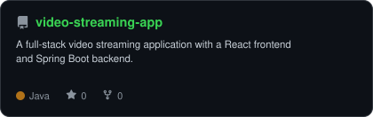
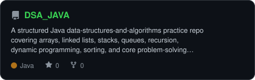

<div align="center">

<!-- PORTRAIT - generated by scripts/dotify.py from assets/my-photo.png.
     Colour mode, so one file serves both GitHub themes. Regenerate with:
       python scripts/dotify.py assets/my-photo.png -o assets/portrait \
         --cols 100 --equalize --detail 0.5 --color --reveal -->


<br>

<!-- NAME / TAGLINE - animated typing -->
<a href="https://github.com/guddukrp">
  
</a>

<br>

<!-- SOCIALS -->
<a href="https://www.linkedin.com/in/guddukrp/"></a>
<a href="mailto:guddukp11@gmail.com"></a>
<a href="https://guddukrp.github.io/portfolio/"></a>
<a href="https://leetcode.com/u/guddukrp/"></a>
<a href="https://www.geeksforgeeks.org/profile/guddukrp?from=explore&amp;tab=activity"></a>


</div>

---

## `~/` whoami

```console
$ cat about.txt
```

Hi, I'm **Guddu Kumar Prasad** , a software developer with 2+ years of
experience building production web and mobile applications with Java, Spring Boot,
React, TypeScript, Supabase, SQLite, and Firebase.

- Currently working on **offline-first educational platforms at Chimple Learning**
- Building across **React/TypeScript frontends, Supabase/SQLite data layers, and Java/Spring Boot APIs**
- Previously built CRM modules with **JSP, Servlets, JDBC, Spring Boot and MySQL** 
- Sharpening **system design and advanced DSA** through **[DSA_JAVA](https://github.com/guddukrp/DSA_JAVA)**
- Portfolio: **[guddukrp.github.io/portfolio](https://guddukrp.github.io/portfolio/)**
- Solved **500+ DSA problems** across **[LeetCode](https://leetcode.com/u/guddukrp/)** and **[GeeksforGeeks](https://www.geeksforgeeks.org/profile/guddukrp?from=explore&amp;tab=activity)**

<br>

<div align="center">

## `~/` toolbox


</div>

---

<div align="center">

## `~/` skill radar

<table>
<tr>
<td width="50%" align="center" valign="middle">

<!-- Self-rated radar - edit assets/skills.json, the workflow redraws it -->
<picture>
  <source media="(prefers-color-scheme: dark)"  srcset="assets/radar-dark.svg">
  <source media="(prefers-color-scheme: light)" srcset="assets/radar-light.svg">
  
</picture>

</td>
<td width="50%" align="center" valign="middle">

<!-- Live radar built from real language byte counts across your repos -->
<picture>
  <source media="(prefers-color-scheme: dark)"  srcset="assets/radar-langs-dark.svg">
  <source media="(prefers-color-scheme: light)" srcset="assets/radar-langs-light.svg">
  
</picture>

</td>
</tr>
</table>

</div>

---

<div align="center">

## `~/` contribution calendar

<!-- Snake eats the contribution graph - .github/workflows/snake.yml -->
<picture>
  <source media="(prefers-color-scheme: dark)"  srcset="https://raw.githubusercontent.com/guddukrp/guddukrp/output/snake-dark.svg">
  <source media="(prefers-color-scheme: light)" srcset="https://raw.githubusercontent.com/guddukrp/guddukrp/output/snake.svg">
  
</picture>

</div>

---

<div align="center">

## `~/` the numbers

<!-- Generated by scripts/cards.py into this repo. -->
<picture>
  <source media="(prefers-color-scheme: dark)"  srcset="assets/card-stats-dark.svg">
  <source media="(prefers-color-scheme: light)" srcset="assets/card-stats-light.svg">
  
</picture>

<br>

</div>

---

<div align="center">

## `~/` selected work

<!-- Cards generated by scripts/cards.py from assets/projects.json.
     Stars, forks and language are pulled live from the API on every run. -->
<table>
<tr>
<td width="50%">
  <a href="https://github.com/guddukrp/syncspace-frontend">
    <picture>
      <source media="(prefers-color-scheme: dark)"  srcset="assets/card-syncspace-frontend-dark.svg">
      <source media="(prefers-color-scheme: light)" srcset="assets/card-syncspace-frontend-light.svg">
      
    </picture>
  </a>
</td>
<td width="50%">
  <a href="https://github.com/guddukrp/syncspace-backend">
    <picture>
      <source media="(prefers-color-scheme: dark)"  srcset="assets/card-syncspace-backend-dark.svg">
      <source media="(prefers-color-scheme: light)" srcset="assets/card-syncspace-backend-light.svg">
      
    </picture>
  </a>
</td>
</tr>
<tr>
<td width="50%">
  <a href="https://github.com/guddukrp/video-streaming-app">
    <picture>
      <source media="(prefers-color-scheme: dark)"  srcset="assets/card-video-streaming-app-dark.svg">
      <source media="(prefers-color-scheme: light)" srcset="assets/card-video-streaming-app-light.svg">
      
    </picture>
  </a>
</td>
<td width="50%">
  <a href="https://github.com/guddukrp/DSA_JAVA">
    <picture>
      <source media="(prefers-color-scheme: dark)"  srcset="assets/card-DSA_JAVA-dark.svg">
      <source media="(prefers-color-scheme: light)" srcset="assets/card-DSA_JAVA-light.svg">
      
    </picture>
  </a>
</td>
</tr>
</table>

<sub>

| project | live | stack |
|---|---|---|
| **[syncspace-frontend](https://github.com/guddukrp/syncspace-frontend)** | [syncspace-gkp.vercel.app](https://syncspace-gkp.vercel.app) | `React` `TypeScript` |
| **[syncspace-backend](https://github.com/guddukrp/syncspace-backend)** | - | `Spring Boot` `PostgreSQL` |
| **[video-streaming-app](https://github.com/guddukrp/video-streaming-app)** | - | `React` `Spring Boot` |
| **[DSA_JAVA](https://github.com/guddukrp/DSA_JAVA)** | - | `Java` `DSA` |

</sub>

</div>

---

<div align="center">

<sub>`01110100 01101000 01100001 01101110 01101011 01110011 00100000 01100110 01101111 01110010 00100000 01110011 01100011 01110010 01101111 01101100 01101100 01101001 01101110 01100111`</sub>

</div>
